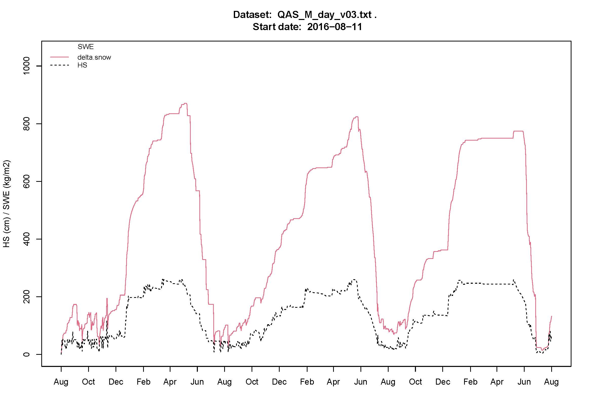
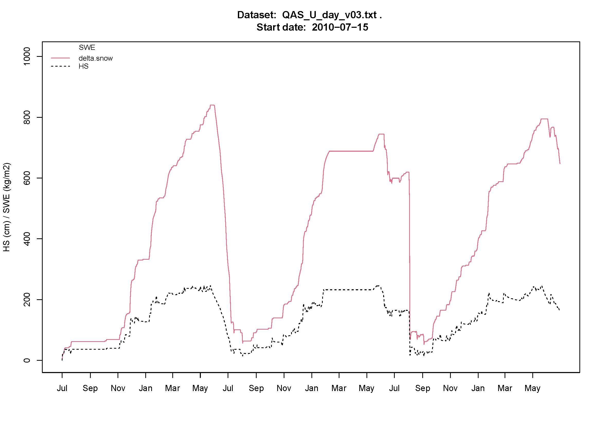
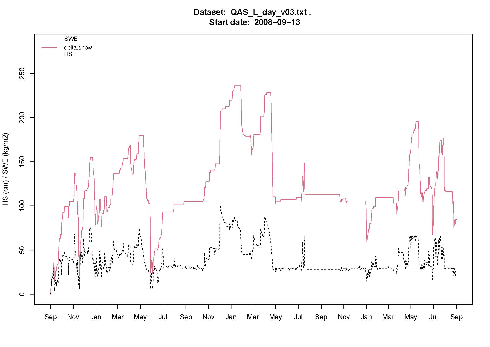

# PROMICE-nixmass

Application of the [nixmass algorithm](https://rdrr.io/rforge/nixmass/man/nixmass.html) to the PROMICE AWS

Winkler, M., Schellander, H., and Gruber, S.: Snow Water Equivalents exclusively from Snow Heights and their temporal Changes: The ΔSNOW.MODEL, Hydrol. Earth Syst. Sci. Discuss., [https://doi.org/10.5194/hess-2020-152](https://doi.org/10.5194/hess-2020-152), in review, 2020.

Script developped by Øyvind Andreas Winton <oew@geus.dk>

The main requirements are:
1) The surface height record should start at zero and should not take any value below the initial value
2) The surface height should be gap-free

